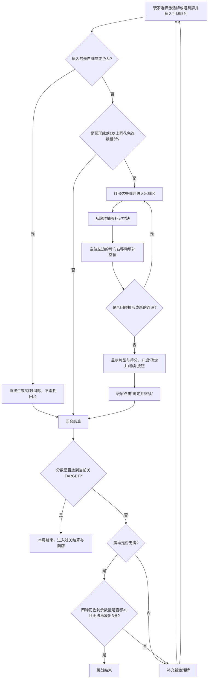

# FIFOCard 游戏规则说明书

## 一、游戏简介
`FIFOCard` 是一款以“激活牌插入队列 + 同花色连消”为核心玩法的单人卡牌游戏。

玩家需要把当前激活牌插入手牌队列中的合适位置，制造 3 张及以上同花色连续相邻的牌组，并利用补牌、位移和碰撞触发更长的连消，以获得更高分数。

---

## 二、游戏目标
通过不断制造消除与连消，获取尽可能高的总分并持续通关。

每一关都有过关分数：
\[
过关分数 = 1000 \times n^2
\]
其中 \(n\) 为关数（从第 1 关开始）。

当本局分数达到当前关过关分数时，本局立即结束并进入下一关。若牌堆无牌时仍未达标，则继续操作剩余手牌；当场上四种花色（不含白牌）的剩余数量都小于 3，且即使有变色龙道具也无法再凑出 3 张同花色时，本次挑战结束。

---

## 三、游戏用牌
- **普通牌**：一副标准扑克牌（去除 Joker），共 52 张。
- **道具牌**：独立存放在道具牌堆（`itemDeck`）中，不混入普通牌堆。包含：
  - **白牌** 10 张
  - **变色龙**（♥/♠/♣/♦）每种 2 张，共 8 张

道具牌无法直接从普通牌堆抽到，仅能通过**过关后的道具商店**购买获得。

---

## 四、界面与区域说明

### 1. 牌堆（Deck）
尚未进入手牌区的普通牌，按洗牌后的顺序堆叠在牌堆中。页面顶部 `DECK` 显示当前剩余数量。

### 2. 手牌队列（Hand Queue）
- 手牌队列数量支持配置为 `9~20` 张
- 默认配置为 `15` 张（不含激活牌）
- 开局会先从牌堆顶部依次抽取“手牌队列数量 + 1”张普通牌
- 其中最右侧的 `1` 张会被移出作为激活牌，剩余牌从左到右排开，称为**手牌队列**
- 按位置编号时，最左侧为 `index 0`，向右依次递增，最右侧为 `index (手牌队列数量 - 1)`
- 插入位置（DropZone）从左到右依次为 `0 ~ N`，其中 `0` 表示最左端（所有牌左侧），`N` 表示最右端（所有牌右侧）

> 当前实现中，可在页面顶部 `HAND` 下拉框直接调整手牌队列数量；支持 `9~20`，超出范围会自动限制。

> 按住“按住查看点数排序”按钮，可临时按点数 A~K 排序预览手牌，松手恢复原始顺序。

### 3. 激活牌（Active Card）
- 开局时，将手牌队列最右侧的 `1` 张牌移出
- 放置到手牌区下方，作为当前可操作的**激活牌**
- 常规状态下，场上保持：
  - 手牌队列为“配置数量”张
  - 普通激活牌 `1` 张

> 点击“放到左端”按钮，可快速将当前选中的牌插入手牌队列最左侧（`index 0`）。

### 4. 道具卡槽（Prop Slot）
- 共设 **2 个**道具卡槽，分别对应“道具 1”和“道具 2”。
- 道具卡槽最多同时存放 2 张道具卡（每槽 1 张）。
- 道具卡与普通激活牌可同时存在。
- 玩家可在任意回合主动点击“使用当前激活牌”或“使用道具 1/2”来切换要出手的牌。
- 道具牌可通过拖拽或点击相应卡槽来插入手牌队列。

### 5. 出牌区（Play Area）
所有成功打出的牌，都会先进入出牌区并展示计算的牌型。一轮连消结束后，需点击**“确定并继续”**按钮，出牌区的牌才会高亮消失并正式结算，随后进入下一回合。

### 6. 关卡与目标分（Level & Target）
- 当前关卡显示在页面顶部 `LEVEL`
- 当前关过关分数显示在页面顶部 `TARGET`
- 达到 `TARGET` 后进入过关结算
- 进入下一关后会重新洗牌并重新发牌，`SCORE` 从 `0` 重新开始（`BEST` 不重置），金币与剩余道具保留

### 7. 即将补牌预览
页面左侧显示牌堆顶部下一张即将补入的牌（背面朝上或已揭示），帮助玩家预判。

---

## 五、开局设置
1. 将 52 张普通牌充分洗匀作为牌堆。
2. 将 10 张白牌和 8 张变色龙洗匀作为道具牌堆。
3. 在页面顶部 `HAND` 下拉框设定手牌队列数量，允许范围为 `9~20` 张，默认值为 `15` 张。
4. 从普通牌堆抽牌补满“手牌队列数量 + 1”张普通牌。
5. 将最右边的 `1` 张普通牌移出，作为第一张激活牌，其余牌保留在手牌队列中。
6. 道具卡槽初始为空。
7. 游戏开始。

---

## 六、核心规则

### 1. 插入规则
玩家每回合需要将当前选中的牌（激活牌或道具牌）插入手牌队列中的任意位置。

### 2. 消除条件
若插入的是普通牌，且插入后与其左右相邻的牌组成了**3 张或以上、且花色相同、并且连续相邻**的牌组，则这些牌被立即打出。

满足消除必须同时满足以下 3 个条件：
- 数量不少于 `3` 张
- 花色相同
- 在队列中连续相邻

> 白牌和变色龙**不参与**同花色连消判定（白牌会阻断连续性；变色龙插入后立即生效并离开队列）。

### 3. 未形成消除时
若插入的是普通牌且未形成 3 张及以上同花色连续相邻，则本回合不发生消除，直接结算并进入“补充新激活牌”步骤。

### 4. 白牌规则（道具机制）
1. **获取方式**：白牌不进入普通牌堆，仅能在过关后的道具商店中用金币购买获得。
2. **使用时机**：玩家可将白牌从道具卡槽插入手牌队列任意位置。
3. **插入后表现**：
   - 白牌不与任何花色形成连消，插入位置左右的花色连续性会被白牌阻断。
   - 插入白牌**不消耗回合**，直接跳过消除检测。
   - **白牌消失时机**：当玩家下一次真正度过一回合（即打出常规激活牌并完成该回合结算）时，手牌队列中已插入的白牌会消失并回收至道具牌堆随机位置。整个回收过程不触发碰撞连消。
   - 若白牌是从激活牌位置打出（正常不会发生，因激活牌仅来自普通牌堆），回收时会在手牌队列左侧补 1 张普通牌；从道具卡槽打出时不补牌。

### 5. 变色龙规则
1. **获取方式**：变色龙与白牌一样，仅在过关后的道具商店中购买获得。
2. **使用时机**：玩家可将变色龙从道具卡槽插入手牌队列。
3. **有效插入**：
   - 变色龙必须插入到**非最左端**（`index > 0`），且其**左侧紧邻的牌不能是白牌**。否则视为无效插入，变色龙会回弹到卡槽，不消耗。
   - 有效插入后，变色龙会将其**左侧紧邻的那张普通牌永久变为自己对应的花色和颜色**，然后变色龙自身回收至道具牌堆底部。
   - 变色龙插入**不消耗回合**，直接返回并可能触发回合结算（但不视为度过一回合，因此不会触发白牌回收）。

---

## 七、回合流程



### 标准回合步骤
1. 玩家每回合可在“当前激活牌”和“道具卡（若有）”之间选择，将选中的牌插入手牌队列任意位置。
2. 若插入的是白牌：本操作不消耗回合，直接跳过消除检测。
3. 若插入的是变色龙：检查有效性，有效则改变左侧牌花色，不消耗回合。
4. 若插入的是普通牌，且形成 3 张或以上同花色连续相邻，则立即打出这些牌。
5. 从牌堆抽取相应数量的普通牌补到手牌队列最左侧。若牌堆剩余不足，则抽完为止。
6. 空位左边的手牌整体向右移动，直到空位被完全填满。
7. 若填补空位后，原本分隔开的左右两侧牌碰在一起，并形成新的 3 张或以上同花色连续相邻，则触发连消。
8. 重复执行“补牌 → 填空 → 碰撞判定”，直到无法再形成连消。
9. 本轮连消结束后，所有打出的牌停留在出牌区，界面显示牌型组合与本轮得分，**“确定并继续”按钮亮起**。
10. 玩家点击“确定并继续”后，出牌区牌高亮消失，正式结算分数，随后处理白牌回收。
11. 回合结算后：若当前普通激活牌为空，则从手牌队列最右侧补一张作为新的普通激活牌；道具卡槽保持独立不受影响。
12. 进入下一回合。

### DEBUG 模式
页面顶部有 `DEBUG连消` 复选框。勾选后，每次补牌后的碰撞检测会暂停，需点击红色的 `继续判定连消 (DEBUG)` 按钮才会继续，便于逐步观察连锁逻辑。

---

## 八、补牌与碰撞连消规则

### 1. 补牌规则
每当有若干张牌被打出后：
- 从牌堆顶部抽取相同数量的牌
- 将这些新牌放入手牌队列的最左侧
- 若牌堆剩余不足，则抽完为止

### 2. 填空规则
被打出的牌会在手牌队列中留下空位。
此时，**空位左边的所有牌向右移动**，直到这些空位被完全填满。

### 3. 碰撞连消规则
如果空位被填补后，原来空位两侧的牌碰在一起，形成了新的 3 张或以上同花色连续相邻，则自动触发连消。

### 4. 连消停止条件
当完成一次补牌和填空后，不再出现新的 3 张及以上同花色相邻牌组时，本轮连消结束，等待玩家点击“确定并继续”。

---

## 九、计分规则

### 1. 牌面分值
| 牌面 | 分值 |
|---|---:|
| A | 11 |
| 2~10 | 对应数字 |
| J | 10 |
| Q | 10 |
| K | 10 |

注：牌面仅用于计算分值。在判断是否能组成顺子等牌型时，点数大小顺序为 A-2-3-4-5-6-7-8-9-10-J-Q-K-A（即 A 既可以作为最小，也可以作为最大）。

### 2. 计分方式
\[
分数 = \lceil \Sigma(牌面分值 \times 牌型倍率) \times 牌数倍率 \times 碰撞倍率 \rceil
\]

### 3. 牌型
| 牌型 | 牌型倍率 |
|---|---|
| 对子 | 2  |
| 三条 | 4  |
| 两对 | 5  |
| 顺子 | 6  |
| 同花 | 6  |
| 葫芦 | 7  |
| 四条 | 10 | 
| 同花顺 | 15 |

牌型只提供“牌型倍率”。程序会自动从打出的所有牌中找出互不重叠的牌型组合，使得 `Σ(牌面分值 × 牌型倍率)` 最大。

### 4. 碰撞倍率
\[
碰撞倍率 = 2^{碰撞连消次数}
\]

### 5. 牌数倍率
\[
牌数倍率 = 1 + (消除牌的数量 - 3) \times 0.5
\]
注：如果仅消除 3 张牌，牌数倍率为 1，此时仅依靠牌型分数得分。

## 九(续)、牌型计算
连消打出的牌需要计算是否能产生牌型，例如
激活连消+碰撞连消的牌如下：
♥2,♥5,♥K,♠K,♠4,♠3,♠7,♦6,♦A,♦7

那么能形成的牌型有：
1、顺子：♥2,♠3,♠4,♥5,♦6
2、顺子：♠3,♠4,♥5,♦6,♦7
3、顺子：♠3,♠4,♥5,♦6,♠7
4、对子：♥K,♠K
5、对子：♠7,♦7
6、两对：♥K,♠K，♠7,♦7

可能形成的牌型组合有：
1、顺子：♥2,♠3,♠4,♥5,♦6 + 两对：♥K,♠K，♠7,♦7
2、顺子：♠3,♠4,♥5,♦6,♦7 + 对子：♥K,♠K
3、顺子：♠3,♠4,♥5,♦6,♠7 + 对子：♥K,♠K
4、两对：♥K,♠K，♠7,♦7

牌型分数计算就是要在所有牌型组合里面找到 `Σ(牌面分值 × 牌型倍率)` 最大的组合，这里是：
顺子：♥2,♠3,♠4,♥5,♦6 + 两对：♥K,♠K，♠7,♦7

即：
\[
\Sigma = (2+3+4+5+6) \times 6 + (10+10+7+7) \times 5 + 11 \times 1
\]

找牌型分数最大的组合由程序自动完成。

> 注意：碰撞产生的连消，与最初打出的牌**合并为同一轮计算分数**。

---

## 十、结束与通关条件
### 1. 通关（进入下一关）
当本局分数达到当前关过关分数时，当前局立即结束。随后：
1. 显示过关结算弹窗，结算利息（`floor(当前金币 / 5)`）和固定奖励 `+3`。
2. 点击“确定”后进入**道具商店**，随机展示 2 张道具（来自道具牌堆），可用金币购买。
3. 未购买的道具会回收并重新洗牌。
4. 点击“离开商店进入下一关”后，进入下一关：重新洗牌发牌，当前分数重置为 `0`（`BEST` 不重置），金币与已购买的道具保留。

### 2. 挑战结束（失败）
当出现以下情况时，本次挑战结束：
- 普通牌堆无牌
- 且场上四种花色（手牌队列 + 当前激活牌，不含白牌）的剩余数量都小于 `3`，即使有变色龙道具也无法使任意花色达到 `3` 张
- 且当前分数尚未达到当前关过关分数

补充说明：
- 当牌堆无牌后，玩家仍可继续操作剩余手牌
- 只要还有任意花色数量大于等于 `3`（或配合变色龙可达到），游戏继续

结算说明：
- 已经打出的牌计分
- 留在手牌队列和激活牌区域中的牌不计分

---

## 十一、经济系统

游戏内置金币经济系统，通关时可获得基础奖励与利息，用于购买道具：

### 1. 基础设定
- **初始金币**：游戏开局玩家拥有 `4` 枚金币。
- **每关通关奖励**：玩家每通过一个关卡，固定获得 `3` 枚金币。

### 2. 利息机制
- **利息计算**：每持有 `5` 个金币，在通关结算时可额外获得 `1` 枚金币的利息（向下取整，即 `floor(当前金币 / 5)`）。
- **结算顺序**：每次通关时，先根据当前拥有的金币结算利息，然后再将“本关通关奖励”与“利息”一并加入玩家的总金币中。

### 3. 道具商店
- **出现时机**：每关过关结算后。
- **商品**：每次从道具牌堆顶部抽取最多 2 张道具（可能是白牌或变色龙）。
- **价格**：白牌 `3` 金币，变色龙 `5` 金币。
- **购买限制**：仅当道具卡槽有空位（2 个卡槽未满）且金币足够时才能购买。
- **离开商店**：未购买的道具将回收至道具牌堆并重新洗牌。

---

## 十二、插图示例 1：激活牌插入后直接形成消除

> 以下示例均基于默认配置：手牌队列 `15` 张，外加 `1` 张激活牌。

### 初始状态
激活牌为 `♣3`，手牌队列如下：

```text
手牌队列：♠A，♥6，♠6，♣K，♣8，♣5，♠7，♠3，♥J，♣4，♦7，♠9，♣Q，♥5，♠2
激 活 牌：♣3
```

### 插入后
将 `♣3` 插入 `index 4` 的位置（即第 4 张牌 `♣K` 与第 5 张牌 `♣8` 之间）：

```text
♠A，♥6，♠6，♣K，[♣3]，♣8，♣5，♠7，♠3，♥J，♣4，♦7，♠9，♣Q，♥5，♠2
```

此时出现连续同花色：

```text
♣K，[♣3]，♣8，♣5
```

共 `4` 张梅花，满足消除条件，立即打出。

### 打出后的空位示意
```text
♠A，♥6，♠6，空，空，空，空，♠7，♠3，♥J，♣4，♦7，♠9，♣Q，♥5，♠2
```

---

## 十三、插图示例 2：补牌与填空后触发碰撞连消

### 第一步：从牌堆补 4 张牌到最左侧
假设抽到：`♠8，♥5，♥A，♥K`

```text
♠8，♥5，♥A，♥K，♠A，♥6，♠6，空，空，空，空，♠7，♠3，♥J，♣4，♦7，♠9，♣Q，♥5，♠2
```

### 第二步：填补空位
空位左边的牌向右移动，直到填满空位：

```text
♠8，♥5，♥A，♥K，♠A，♥6，♠6，♠7，♠3，♥J，♣4，♦7，♠9，♣Q，♥5，♠2
```

### 第三步：碰撞判定
由于填空后出现：

```text
♠6，♠7，♠3
```

这 3 张牌为连续相邻的同花色牌，触发碰撞连消并打出。

### 第二次打出后的队列
```text
♠8，♥5，♥A，♥K，♠A，♥6，空，空，空，♥J，♣4，♦7，♠9，♣Q，♥5，♠2
```

### 再次补牌示例
假设此时从牌堆抽到：`♣9，♦5，♦J`

```text
♣9，♦5，♦J，♠8，♥5，♥A，♥K，♠A，♥6，空，空，空，♥J，♣4，♦7，♠9，♣Q，♥5，♠2
```

再次填空后：

```text
♣9，♦5，♦J，♠8，♥5，♥A，♥K，♠A，♥6，♥J，♣4，♦7，♠9，♣Q，♥5，♠2
```

此时未形成新的 3 张及以上连续同花色牌，因此本轮连消结束。随后玩家需点击“确定并继续”按钮，进入下一回合。

### 回合结束后的新激活牌
将最右边的 `♠2` 取出，作为新的激活牌。
此时手牌队列保持默认配置下的 `15` 张：

```text
手牌队列：♣9，♦5，♦J，♠8，♥5，♥A，♥K，♠A，♥6，♥J，♣4，♦7，♠9，♣Q，♥5
激 活 牌：♠2
```

---

## 十四、插图示例 3：计分示例
继续沿用上面的示例：

### 第一次打出
```text
♣K，♣3，♣8，♣5
```
面值总和为：

\[
10 + 3 + 8 + 5 = 26
\]

（注：K 的分值为 10）

本轮目前累计打出 `4` 张，牌数倍率为 `1 + (4-3)*0.5 = 1.5` 倍。

### 第二次碰撞连消
```text
♠6，♠7，♠3
```
面值总和为：

\[
6 + 7 + 3 = 16
\]

### 整轮合并计算
本轮总共打出 `7` 张牌：

\[
4 + 3 = 7
\]

本轮总面值：

\[
26 + 16 = 42
\]

本轮共发生 `1` 次碰撞连消，碰撞倍率为 `2`；
`7` 张牌的牌数倍率为 `1 + (7-3)*0.5 = 3`。若本轮无额外牌型加成，则本轮总得分为：

\[
42 \times 3 \times 2 = 252
\]

---

## 十五、玩家理解要点
- 不是只看当前能不能消，还要看补牌与填空后会不会产生碰撞连消。
- 消除越多，倍率越高；同一轮累计张数越大，得分增长越快。
- 想拿高分，关键在于制造长连锁，而不是只追求单次小消除。
- 善用变色龙改变关键牌的花色，可以制造出原本不存在的连消机会。
- 白牌可以临时占据一个位置来改变左右牌的相对位置，为后续连消做铺垫。

---

## 十六、一句话总结
> 把激活牌插进最合适的位置，制造同花色连续相邻消除，并通过连消、牌型和道具获取高分，持续通关！
